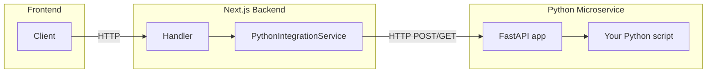

# Python FastAPI Microservice (HTTP Activation)

## Goal

Run your Python logic as a **separate FastAPI microservice** and have the Next.js backend invoke it via **HTTP** from a service layer, so handlers stay thin and the Python service can be scaled or deployed independently.

## Architecture

- **Frontend** → calls Next.js API (unchanged).
- **Handler** → authenticates, parses body, calls a backend **service**.
- **Service** → performs HTTP request to the Python microservice base URL (from env), maps response/errors.
- **FastAPI app** → exposes one or more endpoints that delegate to your existing Python script logic and return JSON.

---

## 1. Add the Python microservice app

- **Location:** New app in the monorepo, e.g. `apps/python-service/` (or `services/python-service/` if you prefer a `services` folder).
- **Contents:**
  - **`main.py`** (or `app/main.py`): FastAPI application instance, CORS middleware, and route definitions.
  - **`requirements.txt`**: `fastapi`, `uvicorn[standard]`, and any dependencies your existing script needs.
  - **Router/endpoint:** One or more POST (or GET) endpoints that accept JSON, call your existing Python script’s logic (import and call functions, or refactor the script into callable functions), and return a JSON response (e.g. Pydantic models).
  - **Script integration:** Either:
    - Move your script’s logic into a module (e.g. `lib/your_logic.py`) and import it in the FastAPI route, or
    - Keep a thin CLI entrypoint and have the route run it via `subprocess` and parse stdout (less ideal but quick). Prefer importing and calling functions for better error handling and performance.
  - **Health check:** e.g. `GET /health` returning `{"status": "ok"}` so the Next.js app or dev scripts can verify the service is up.
- **Run locally:** e.g. `uvicorn main:app --reload --port 8000` (port configurable). Document in a short `README.md` in the Python app (and optionally in the root docs).

---

## 2. Define the HTTP contract

- **Request:** Document (or add OpenAPI docstrings) the JSON body each FastAPI endpoint expects (e.g. input fields, types).
- **Response:** Document the JSON shape returned on success (and optionally on validation/application errors) so the Next.js service can rely on it.
- **Errors:** Use FastAPI’s `HTTPException` and consistent error response bodies (e.g. `{"detail": "..."}` or `{"error": "code", "message": "..."}`) so the Node client can map them to HTTP status codes and error types.

---

## 3. Next.js backend: HTTP client and service

- **Config:** Add an env var for the Python microservice base URL (e.g. `PYTHON_SERVICE_URL=http://localhost:8000`). Use it in the backend only (e.g. `apps/backend/.env` or your existing env setup).
- **HTTP client:** In `apps/backend/src/`, add a small module (e.g. `utils/pythonServiceClient.ts` or under `api/clients/`) that:
  - Takes the base URL from config.
  - Exposes a function per FastAPI operation (e.g. `runBackendTask(body: PythonInput): Promise<PythonOutput>`).
  - Uses `fetch` with a timeout (e.g. `AbortController` + `setTimeout`), sends JSON, parses JSON response.
  - Maps non-2xx responses and network/timeout errors to a typed result or thrown error (e.g. `PythonServiceError` with `status`, `message`, or `code`).
- **Service layer:** Add or extend a service (e.g. `apps/backend/src/api/services/pythonIntegrationService.ts`) that:
  - Calls the HTTP client.
  - Converts client errors into domain-friendly errors or return types that handlers can interpret.
  - Keeps the same kind of interface other Koda services use (e.g. one method per “operation” the frontend needs).

---

## 4. Wire a handler and route

- **Handler:** In an existing or new handler file (e.g. `pythonHandlers.ts` or the appropriate domain handler), add a function that:
  - Authenticates (e.g. `authenticateToken` or `authenticateTokenToUserId`).
  - Reads and validates the request body (matching what the Python service expects).
  - Calls the new backend service method.
  - Returns `NextResponse.json` with the right status (e.g. 200 with result, 502/504 on Python service failure or timeout).
- **Route:** In [apps/backend/src/app/[...slug]/route.ts](apps/backend/src/app/[...slug]/route.ts), add a branch in the `dispatch` function for the new path (e.g. `POST /python/run` or a domain-specific path like `POST /sessions/:id/analyze`) and invoke the new handler.

---

## 5. Local development and scripts

- **Run both:** Ensure the Python service runs on its own port (e.g. 8000) and the Next.js backend on 3001. Either:
  - Add a script in the **root** `package.json` to run both (e.g. `concurrently` for `npm run dev -w apps/backend` and `uvicorn` for the Python app), or
  - Document “start Python service, then start backend” in the Python app README and in the main docs.
- **Backend .env:** Set `PYTHON_SERVICE_URL` (and optionally a timeout) so the backend knows where to call.

---

## 6. Optional: tests and robustness

- **FastAPI:** Add a simple test (e.g. `pytest` + `TestClient`) that hits the new endpoint with sample JSON and asserts the response shape and status.
- **Next.js:** Add a unit test for the HTTP client or service that mocks `fetch` and asserts correct URL, body, and error handling; optionally an e2e test that assumes the Python service is running and calls the new Next.js route.

---

## Summary of deliverables

| Item                 | Location / action                                                   |
| -------------------- | ------------------------------------------------------------------- |
| FastAPI app + routes | `apps/python-service/` (main.py, router, health)                    |
| Script integration   | Refactor script into callable module or subprocess from route       |
| requirements.txt     | `apps/python-service/requirements.txt`                              |
| Backend HTTP client  | `apps/backend/src/utils/pythonServiceClient.ts` (or `api/clients/`) |
| Backend service      | `apps/backend/src/api/services/pythonIntegrationService.ts`         |
| Handler + route      | New or existing handler; new branch in `[...slug]/route.ts`         |
| Env var              | `PYTHON_SERVICE_URL` in backend                                     |
| Dev run              | Root or app-level script to run backend + Python service            |

No `child_process` or Python binary from Node: all interaction is **HTTP** to the FastAPI microservice.
